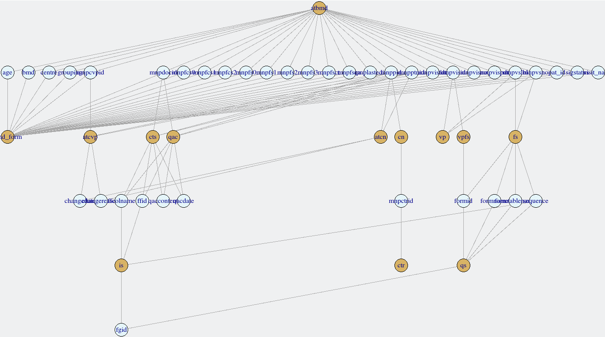

<!-- README.md is generated from README.Rmd. Please edit that file -->


# secuTrialR 

An R package to handle data from the clinical data management system (CDMS) [secuTrial](https://www.secutrial.com/en/).

## Installing from github with devtools


```r
devtools::install_github("SwissClinicalTrialOrganisation/secuTrialR")
```

## Basic usage
Load the package

```r
library(secuTrialR)
```
### Load the dataset

```r
# prepare path to example export
export_location <- system.file("extdata", "s_export_CSV-xls_BMD.zip",
                               package = "secuTrialR")
# load all export data
sT_export <- load_secuTrial_export(data_dir = export_location)

names(sT_export)
```

```
##  [1] "export_options" "fs"             "cn"             "ctr"           
##  [5] "is"             "qs"             "qac"            "vp"            
##  [9] "vpfs"           "atcn"           "atcvp"          "cts"           
## [13] "bmd"            "atbmd"
```

`load_secuTrial_export` returns an object of class `secuTrialdata`, which is basically a list. It will always contain `export_details` (which are parsed from the HTML ExportOptions file that secuTrial generates). By default, it will also contain all other files in the dataset. secuTrialR automatically strips file names of dates. The new file names can be seen via `sT_export$export_options$data_names`.
<!-- DEDICATED ACCESSOR FUNCTION FOR DATA_NAMES? might already be implemented in the print method -->

`sT_export` is a list, with class `secuTrialdata`. To prevent it from printing all data to the console, a special print method returns some useful information about the objects within `sT_export` instead. The information returned includes the original file name in the datafile, it's name in the `secuTrialdata` object, together with the number of rows and columns and a column indicating whether the object is metadata or not:

```r
sT_export
```

```
## SecuTrial data imported from /home/wrightp/R/x86_64-suse-linux-gnu-library/3.6/secuTrialR/extdata/s_export_CSV-xls_BMD.zip 
##  table nrow ncol  meta original_name
##     vp    1   10  TRUE        vp.xls
##   vpfs    1    2  TRUE      vpfs.xls
##     fs    1    7  TRUE        fs.xls
##     qs    1    7  TRUE        qs.xls
##     is    3    8  TRUE        is.xls
##    ctr    1    3  TRUE       ctr.xls
##     cn  113   13  TRUE        cn.xls
##   atcn    0    6  TRUE      atcn.xls
##  atcvp    0   11  TRUE     atcvp.xls
##    qac    0   10  TRUE       qac.xls
##    cts    0    8  TRUE       cts.xls
##    bmd  504   27 FALSE       bmd.xls
##  atbmd    0   28 FALSE     atbmd.xls
```

Indiviual tables can be extracted from the `sT_export` object via `tab <- sT_export$tab`, where `tab` is the table of interest.
<!-- accessor function? -->
<!-- print method for secuTrialoptions (metadata)? -->

### Variable labels
For creating tables, it is often useful to have access to variable labels. This is simple in secuTrialR.

```r
labs <- labels_secuTrial(sT_export)
# query the list with the variable name of interest
labs[["age"]]
```

```
## [1] "Age"
```

### Visit plan
secuTrialR can provide a depiction of the visit structure:

```r
vs <- visit_structure(sT_export)
plot(vs)
```
<!-- PLOT METHOD DIRECTLY FOR secuTrialdata objects? -->
 
### Prepare factors
It is often useful to have categorical variables as factors (R knows how to handle factors). secuTrialR can prepare factors easily.

```r
export_location <- system.file("extdata", "s_export_CSV-xls_CTU05_longnames_sep_ref.zip",
                               package = "secuTrialR")
dat <- load_secuTrial_export(export_location)
factors <- factorize_secuTrial(dat)
```
This functions loops through each table of the dataset, creating new factor variables where necessary. The new variables are the same as the original but with `.factor` appended (i.e. a new variable called `sex.factor` would be added to the relevant form).


```r
# original variable
str(factors$ctu05baseline$gender)
```

```
##  int [1:17] 1 NA NA 2 1 2 1 NA NA 1 ...
```

```r
# factor
str(factors$ctu05baseline$gender.factor)
```

```
##  Factor w/ 2 levels "male","female": 1 NA NA 2 1 2 1 NA NA 1 ...
```

```r
# cross tabulation
table(original = factors$ctu05baseline$gender, factor = factors$ctu05baseline$gender.factor)
```

```
##         factor
## original male female
##        1    5      0
##        2    0      5
```


### Prepare dates
Dates are a very common data type. They cannot be easily used though in their export format. This is also easily rectified in secuTrialR:

Date-time variables (e.g. something of the format `2019-05-07 08:35`) are not yet handled.


```r
dates <- dates_secuTrial(dat)
```

### Linking different forms

Linkages amongst forms can be explored with the `links_secuTrial` function. This relies on the `igraph` package to create a network. The network is plotted using `rgl`, which allows one to interact with the network (e.g. move nodes around in order to read the label better). The device ID is returned to the console, but can be ignored. Forms are plotted in red, variables in blue.


```r
links_secuTrial(sT_export)
```

<!-- Figure has to be generated outside of the Rmd file - resize the window and select view/"fit to screen", export it to a PDF and then convert it to a PNG -->


## For contributors
### Testing with devtools


```r
# run tests
devtools::test("secuTrialR")
# spell check -> will contain some R and secuTrial specific words which is fine
devtools::spell_check("secuTrialR")
```

### Linting with lintr


```r
# lint the package -> should be clean
library(lintr)
lint_package("secuTrialR", linters = with_defaults(camel_case_linter = NULL,
                                                   object_usage_linter = NULL,
                                                   line_length_linter(125)))
```

### Generating the README file

The README file contains both standard text and interpreted R code. It must therefore be compiled. Changes should be made in the `README.Rmd` file and the file "knited" with R. This is easiest with RStudio, but other methods are available.


```r
library("knitr")
knit("README.Rmd")
```

### Guidelines for contributors

In order to contribute to this R package you should fork the main repository.
After you have made your changes please run the 
[tests](README.md#testing-with-devtools)
and 
[lint](README.md#linting-with-lintr) your code as 
indicated above. If all tests pass and linting confirms that your 
coding style conforms you can send a pull request (PR).  
The PR should have a description to help the reviewer understand what has been 
added/changed. New functionalities must be thoroughly documented, have examples 
and should be accompanied by at least one [test](tests/testthat/) to ensure long term 
robustness. The PR will only be reviewed if all travis checks are successful. 
The person sending the PR should not be the one merging it.

A depiction of the core functionalities for loading can be found [here](inst/extdata/secuTrialR.png).
